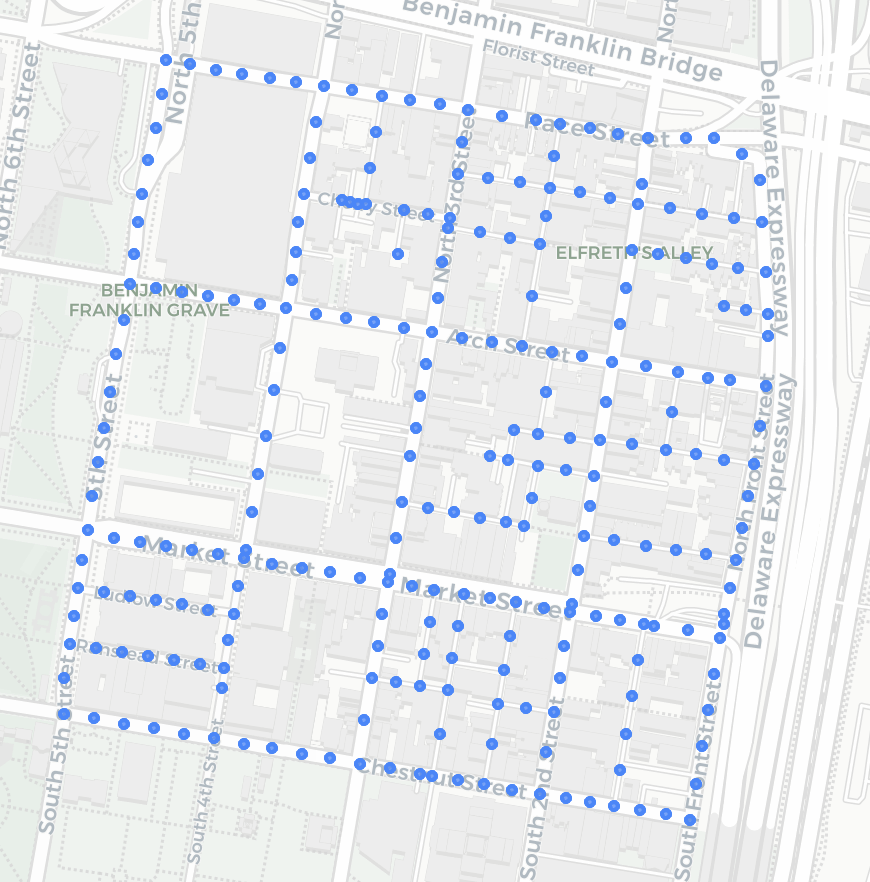
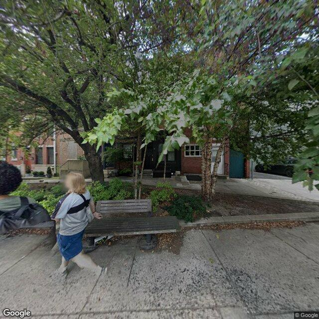
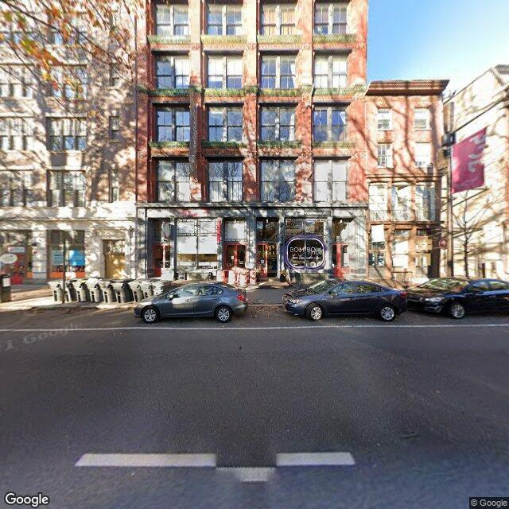
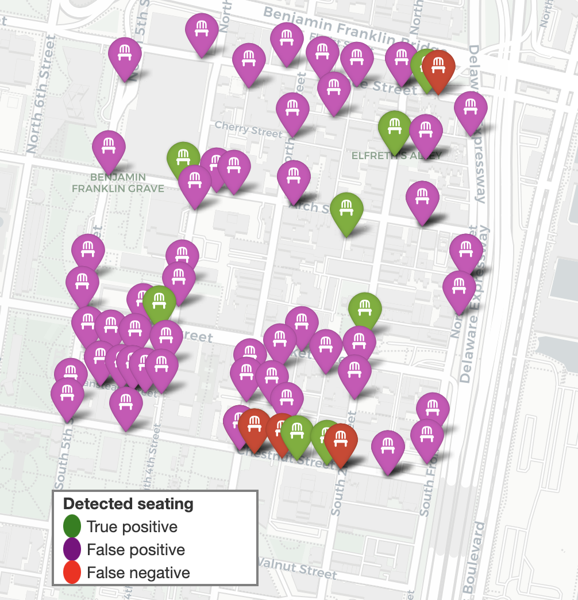

# Resting in Public Space: Automatic Detection and Mapping of Seating

## Motivation

The availability of places to sit is an under-appreciated component of well-functioning public spaces. Spaces lacking free, publicly-accessible points to rest and recharge are distinctly less accessible and therefore less effective as public space. 

However, for users of public space, finding *where* to sit is a challenge in itself, because these points are not tracked on mapping applications. Unless you are already familiar with an area, often the only way to find seating is to look for it yourself by walking around, or by scrolling manually through Google Street View. 

The purpose of this project is to train an image classifier on exemplars of public seating in Philadelphia, and use the trained model to find (and show on a map) where public seating may be found.

This project focuses on Old City, Philadelphia, which is a relatively small area geographically but sees a great deal of foot traffic from visitors.

## Methods

First, a Mask R-CNN model is trained on hand-labeled exemplars of public seating, such as benches. (I count multifunctional seats such as those incorporated into bus shelters, but not private seating such as outdoor restaurant seating.) The training examples were derived from Google Street View images taken in Philadelphia, excluding any from within Old City.

Then, coordinates are sampled at regular intervals from Old City's street network, at which points Google Street View images are retrieved. Using Google's API, the images corresponding to the most recent snapshots close to each coordinate are saved—one for each view towards the sidewalk from the Street View vehicle.

The images below show the coordinates from which the Street View images were taken, as well as some examples of the images themselves.

These Street View images are then fed through the trained R-CNN model. For each image, the presence of at least one class instance label passing the threshold of 0.9 is taken to indicate the presence of public seating visible from that point. (Both the model training and predictions are performed on Google Colab using the included Jupyter notebooks. Other operations were performed locally.)

The results are mapped according to the coordinates of the Street View image, and model performance is evaluated.

# Results

The map below shows each coordinate at which the model detected seating, plus a few points where the model returned a false negative, for reference.

The poor specificity of the model (0.149) is shown by the large number of false positive instances compared to true positives.[^1] The map does, however, contextualize the on-paper poor recall of the model (0.625) by showing that images where the model yielded a false negative are often close by other points where the model yielded a true positive, usually a different viewing angle of the same group of benches. Therefore, the relatively poor recall performance is not practically as harmful as might seem at first glance.

[^1]: The detection threshold was tweaked to higher values in hopes that this might reduce false positive rates without burdening the true positive rate, but this proved inaffective for meaningfully increasing the F-score.

# Discussion

The model's performance leaves much room for improvement. The confusion metrics are quite poor, especially for precision. The class imbalance in the dataset, with only 16 out of 496 test images (or 3%) containing any instances that the model should have recognized, may have contributed to the performance difficulties.

Improving image quality might be a fruitful avenue for improving model performance; as seen in the sample images above, the 640x640 images are at fairly low resolution, much lower than the testing images which were manually screen-grabbed from Street View. The lower resolution may have led to poor generalizability of the trained parameters. The tradeoff with higher image quality, however, would be in the longer download time (and potentially cost) as well as increased model evaluation time, which took more than an hour on the current images on Google Colab.

Improving the selection of Street View images may help as well. While the current approach takes the latest available image from close to the intended coordinates, many images were quite out of date, some dating back as far as 2011. The image selection process could privilege recency rather than geographic exactness. Another strategy might be to densify the samples, testing multiple recent images in close proximity to each other, to mitigate for effects of passing cars blocking the view of benches on the sidewalk, which occurred in the present imageset at least once.

In closing, the present work demonstrates a proof of concept for the goal of detecting instances of public seating by training an image classification model on Google Street View images. An improved data collection strategy will be important in improving model performance and the practical viability of this approach.
